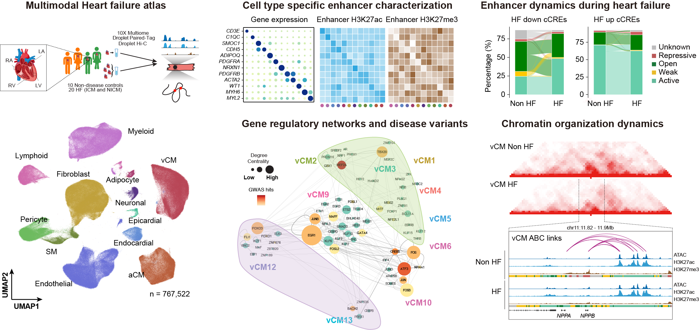

# FNIH Heart 
FNIH Heart is a single-nuclei, multi-modalities epigenetic atlas on human heart failure.
  

🍷 This repository contains code and data to reproduce the results for our manuscript: **Single cell multiomics and 3D genome architecture reveals novel pathways of human heart failure**
  
  

## Abstract
Heart failure is a leading cause of morbidity and mortality; yet gene regulatory mechanisms driving cell type-specific pathologic responses remain undefined. Here, we present the cell type-resolved transcriptomes, chromatin accessibility, histone modifications and chromatin organization of non-failing and failing human hearts that were discovered from interrogating 776,479 cells spanning all cardiac chambers. Further multimodal analyses revealed dynamic changes in cell type abundance, gene regulatory programs and chromatin organization, which expanded the annotation of cardiac cis-regulatory sequences by ten-fold and uncovered cell type-specific enhancer-gene interactions. Cardiomyocytes and fibroblasts particularly exhibited complex disease-associated cellular states. Mapping genetic association data onto cell type-specific regulatory programs revealed likely causal genetic contributors to heart failure. Together, these findings provide comprehensive, multimodal gene regulatory maps of the human heart in health and disease, offering a valuable framework for designing precise cell type-targeted therapies for treating heart failure.
  

## [01.pre-process](https://github.com/Xieeeee/FNIH_Heart/tree/main/01.pre-process)
This directory contains code for pre-processing data from different modalities. 

## [02.analysis](https://github.com/Xieeeee/FNIH_Heart/tree/main/02.analysis)
This directory contains code for re-producing figures in our manuscript. 

## [03.data](https://github.com/Xieeeee/FNIH_Heart/tree/main/03.data)
Processed data for this project can be found at XXX, raw data can be found at dbGaP.
