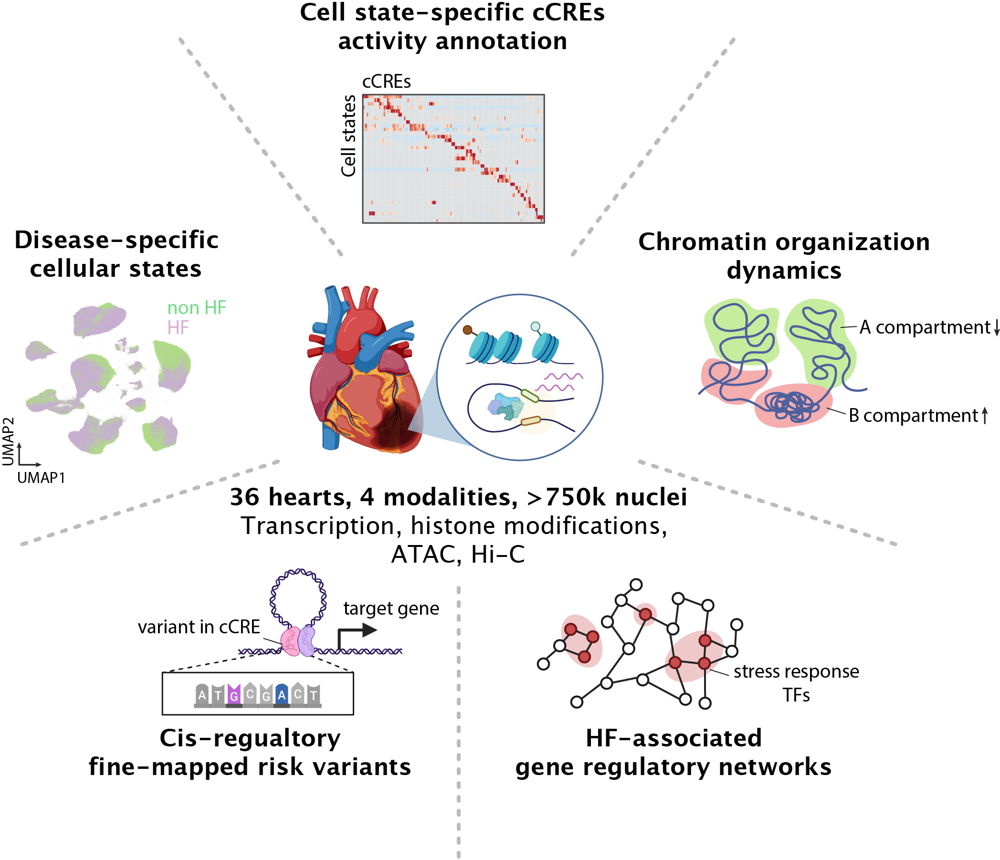

<table border="0" cellspacing="0" cellpadding="0">
<tr>
<td valign="top">

# FNIH Heart

**A single-nuclei, multi-modalities epigenetic atlas of human heart failure.**

</td>
<td width="210" valign="top" align="right">

</td>
</tr>
</table>

🍷 This repository contains the code and data to reproduce the results of our manuscript:
**Single cell multiomics and 3D genome architecture reveals novel pathways of human heart failure**

## Abstract

Heart failure is a leading cause of morbidity and mortality; yet gene regulatory mechanisms driving cell type-specific pathologic responses remain undefined. Here, we present the cell type-resolved transcriptomes, chromatin accessibility, histone modifications and chromatin organization of non-failing and failing human hearts that were discovered from interrogating 776,479 cells spanning all cardiac chambers. Further multimodal analyses revealed dynamic changes in cell type abundance, gene regulatory programs and chromatin organization, which expanded the annotation of cardiac cis-regulatory sequences by ten-fold and uncovered cell type-specific enhancer-gene interactions. Cardiomyocytes and fibroblasts particularly exhibited complex disease-associated cellular states. Mapping genetic association data onto cell type-specific regulatory programs revealed likely causal genetic contributors to heart failure. Together, these findings provide comprehensive, multimodal gene regulatory maps of the human heart in health and disease, offering a valuable framework for designing precise cell type-targeted therapies for treating heart failure.

## Repository structure

| Directory | Contents |
| --- | --- |
| [**01.pre-process**](./01.pre-process) | Per-modality preprocessing pipelines, plus shared SLURM submission scripts. |
| [**02.analysis**](./02.analysis) | Downstream analyses reproducing the manuscript figures. |
| [**03.data**](./03.data) | Data access details for raw and processed data. |

### 01.pre-process

| Modality | Description |
| --- | --- |
| [00.Multiome](./01.pre-process/00.Multiome) | 10X Multiome (snRNA + snATAC from the same nuclei), for the FNIH and CAREHF cohorts. |
| [01.Droplet_Paired_Tag](./01.pre-process/01.Droplet_Paired_Tag) | Droplet Paired-Tag (DPT): histone modifications and RNA from the same nuclei. |
| [02.Droplet_HiC](./01.pre-process/02.Droplet_HiC) | Droplet Hi-C: single-cell 3D genome organization. |
| [scripts](./01.pre-process/scripts) | SLURM batch scripts for Droplet Hi-C and preprocessing. |

### 02.analysis

| Analysis | Description |
| --- | --- |
| [00.integration](./02.analysis/00.integration) | Cross-modality integration (RNA, ATAC, Hi-C) using Harmony and custom embeddings. |
| [01.cCRE](./02.analysis/01.cCRE) | Candidate cis-regulatory elements, and differential accessibility / expression between heart failure and control. |
| [02.GRN](./02.analysis/02.GRN) | Gene regulatory network inference linking transcription factors to target genes via cCREs. |
| [03.Hi-C](./02.analysis/03.Hi-C) | A/B compartments, chromatin domains, and differential Hi-C compartment (DHC) analysis. |
| [04.gwas](./02.analysis/04.gwas) | GWAS heritability enrichment (LDSC) and fine-mapping of causal variants through regulatory maps and Hi-C loops. |
| [scripts](./02.analysis/scripts) | Shared R utility functions. |

## Data availability

- **Raw data** - all raw sequence and genotyping data have been deposited in [dbGaP](https://www.ncbi.nlm.nih.gov/gap/); the accession number is listed on Zenodo.
- **Processed data** - processed data and supplementary tables are available on [Zenodo](https://doi.org/10.5281/zenodo.15232790) (doi: 10.5281/zenodo.15232790).
- **Epigenomic tracks** - browse the processed tracks on our web portal: [HeartEpigenome](https://epigenome.wustl.edu/HeartEpigenome/).
